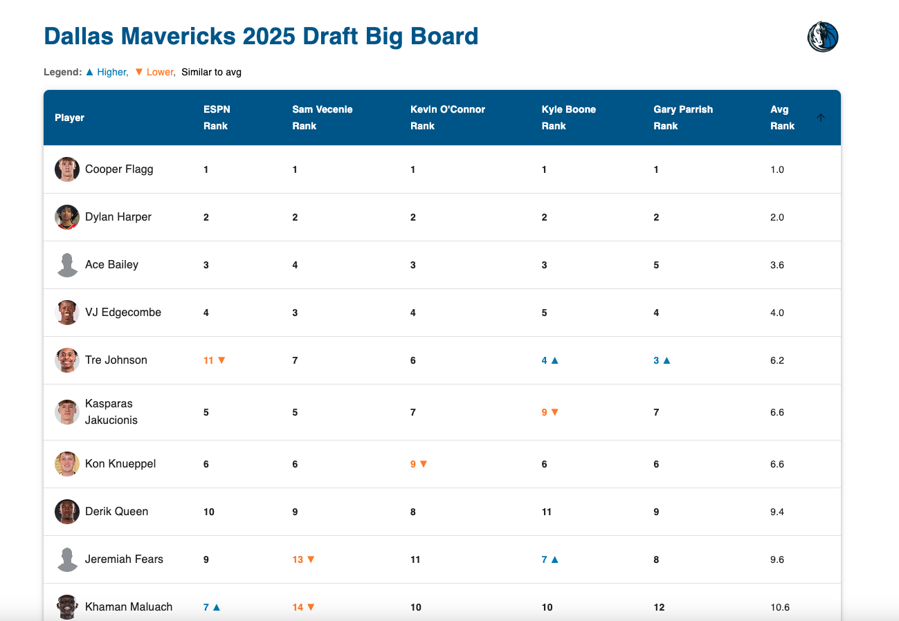
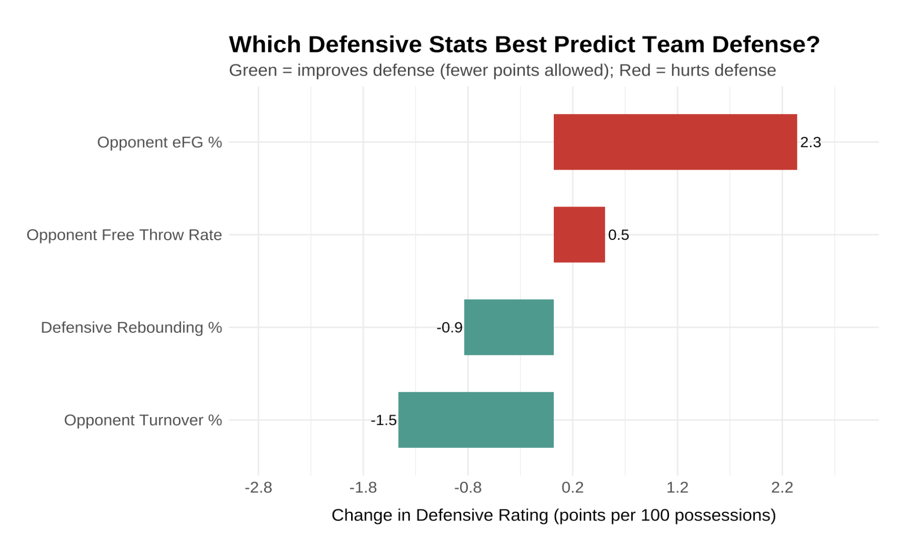
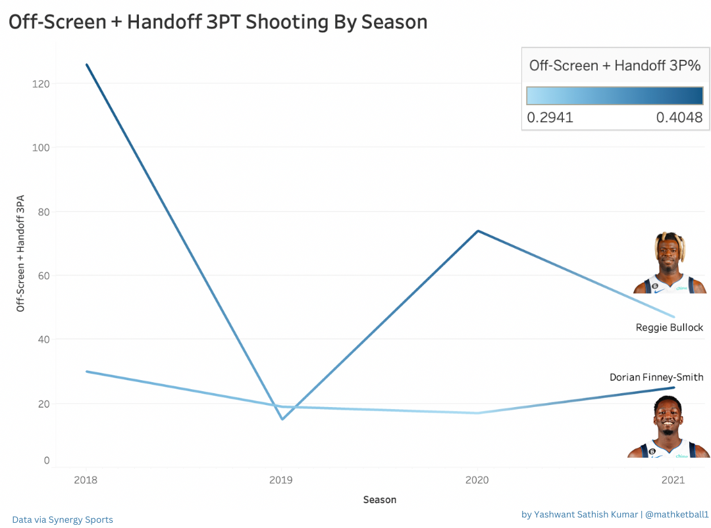
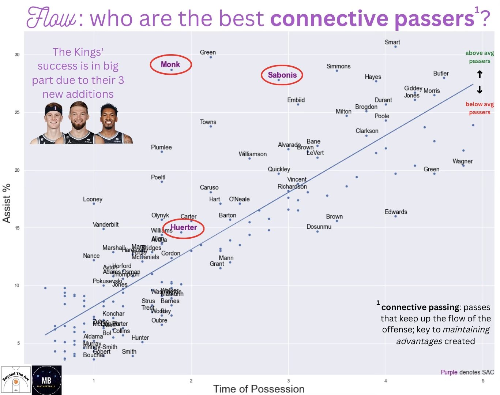
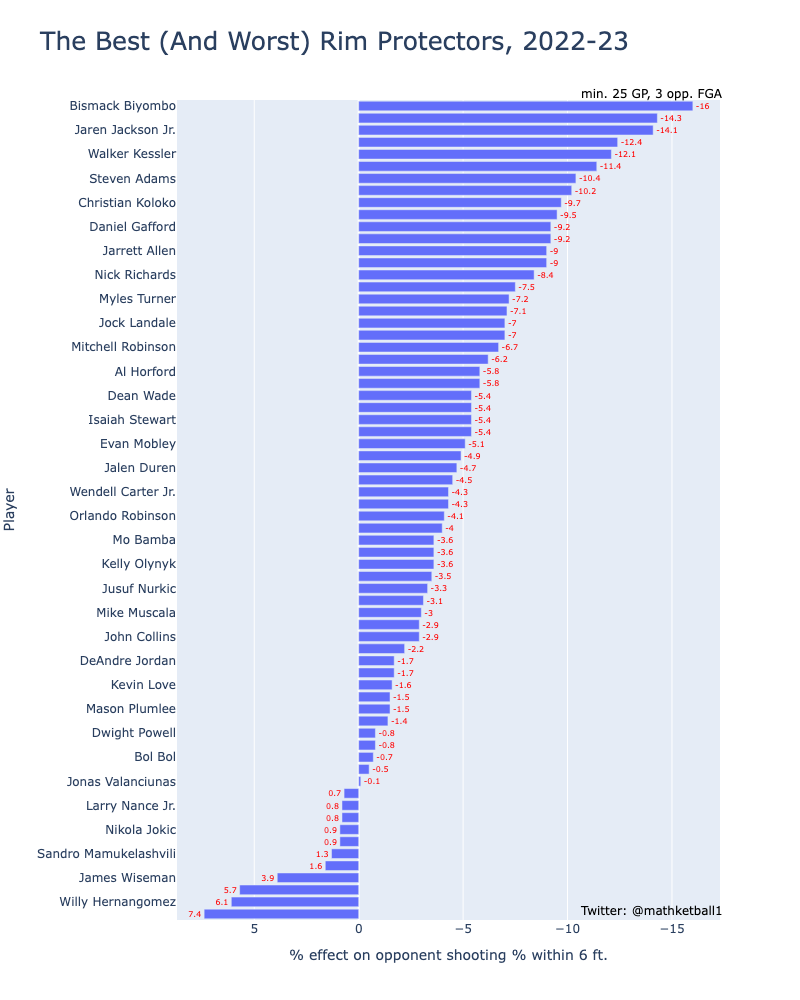
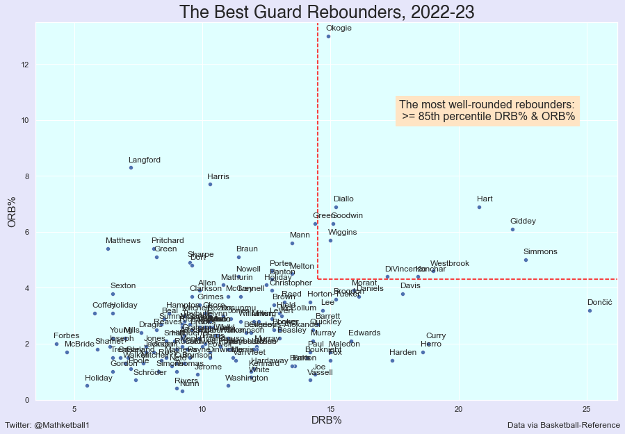
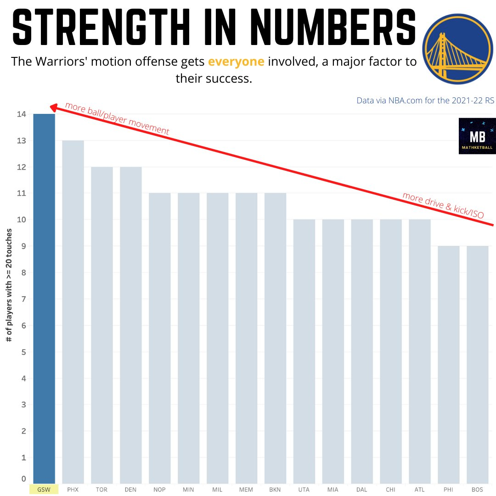

# Yashwant Kannan Sathish Kumar – Software/Data Analysis Portfolio

Hi, I'm Yashwant! I'm a Computer Science graduate from Cal Poly SLO with an immense passion for software engineering and data analytics. I've combined this with my love for NBA basketball to develop several analytics-driven projects that aim to improve game strategy and roster construction. This repository showcases my technical skillset and project evolution across data visualization, statistical modeling, and full-stack development.

---

## [Project 1: NBA Draft Hub – A One-Stop Application For Scouting Info For Front Office Decision Makers](https://github.com/yashwantsathish/Mavs-Draft-Hub)

**Live Demo:** [Mavs Draft Hub](https://mavsdrafthub-yash.netlify.app/)  
1. Built a responsive full-stack application using **React**, **Material UI**, and **Vite** to showcase draft prospects.  
2. Designed the UI with sortable and searchable tables, player profile pages, and custom visual indicators for key metrics.  
3. Parsed and processed JSON-based player data with filtering logic and clean UX.  
4. Built with scalability in mind to support multiple draft classes and front office customization.  
5. Prioritized fast load times and mobile-friendly layout for real-world basketball ops use.

---

## [Project 2: Defensive Efficiency – A Multi-Season Analysis of Key Predictors](https://github.com/yashwantsathish/Defensive-Factors-Analysis)

1. Conducted a regression analysis across 5 NBA seasons (2020–21 to 2024–25) to determine which defensive stats most strongly affect Defensive Rating. Helped Cal Poly Coaching Staff develop defensive system accordingly.
2. Used `hoopR` to scrape NBA Stats API for advanced and opponent data, engineered metrics like Opponent eFG%, Turnover %, and FT Rate.  
3. Built a multiple regression model with season fixed effects and standardized coefficients to compare impact.  
4. Visualized findings using `ggplot2` to clearly communicate results to coaches — emphasizing shot quality and turnovers as the top defensive levers.  
5. Developed a polished Quarto report and final visualization for basketball ops presentation.  

## [Project 3: Analyzing Movement Shooting Proficiency to Explain the Thinking Behind a Playoff Coaching Adjustment](https://matthewkjho.wordpress.com/2023/08/23/film-and-analytics-intersect-how-a-defensive-change-gave-the-warriors-an-edge-in-the-2022-nba-playoffs/)

1. Scraped 450+ values from Synergy playtype tables (handoffs/off-screen) and cleaned in Excel.  
2. Built a Tableau dashboard using joined tables to compare player movement shooting.  
3. Visualized with a double-line chart to support a coaching decision narrative.  
4. Touched-up in Canva for clarity and presentation.

---

## [Project 4: Measuring 'Connective Passing' to Explain the Success of the Sacramento Kings' Offensive System](https://github.com/yashwantsathish/Connective-Passing-Analysis/tree/main)

1. Scraped 600+ values from stats.nba.com and Basketball Reference.  
2. Merged touch and passing data using Pandas, cleaned and filtered the dataset.  
3. Visualized the relationship between Assist % and Time of Possession using Seaborn and Matplotlib.  
4. Used NumPy to fit and plot a regression line denoting 'average' connective passing.  
5. Final visual polished in Canva.

---

## [Project 5: Finding a Measure for 'Rim Protection Ability'](https://github.com/yashwantsathish/Rim-Defense-Analysis)

1. Pulled 500+ shot defense values from the NBA API (shots within 6 feet).  
2. Cleaned and structured data using Pandas.  
3. Graphed player impact on FG% at the rim using Plotly horizontal bar charts.  
4. Built to assist front offices in identifying hidden defensive value.

---

## [Project 6: Identifying the Best & Most Well-Rounded Guard Rebounders](https://github.com/yashwantsathish/Guard-Rebounding-Analysis)

1. Scraped rebounding stats from Basketball Reference and cleaned in Excel.  
2. Imported to Python, visualized OREB% vs DREB% using Seaborn and Matplotlib.  
3. Created a custom bounding box using 85th percentile thresholds to highlight elite rebounders.  

---

## Project 7: Measuring Offensive 'Involvedness' Across a Roster

**Twitter Writeup:** [See thread](https://twitter.com/Mathketball1/status/1558086524297654272)  
1. Pulled roster-level touch data via NBA API into Excel.  
2. Filtered for players with 20+ touches and aggregated by team.  
3. Built visual in Tableau to illustrate the benefits of distributed offensive involvement in Golden State’s motion offense.  
4. Canva used for finishing touches.

